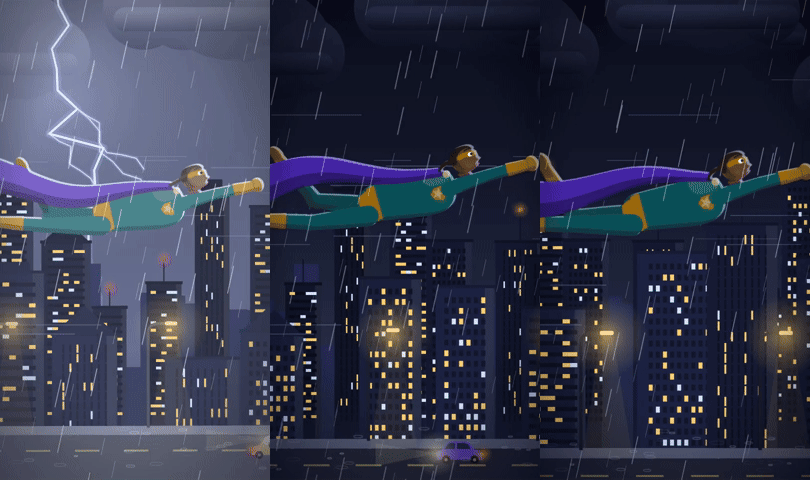
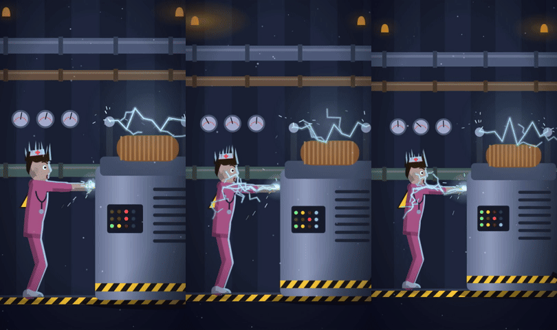
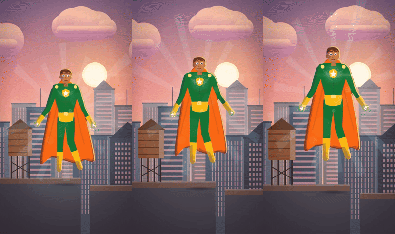
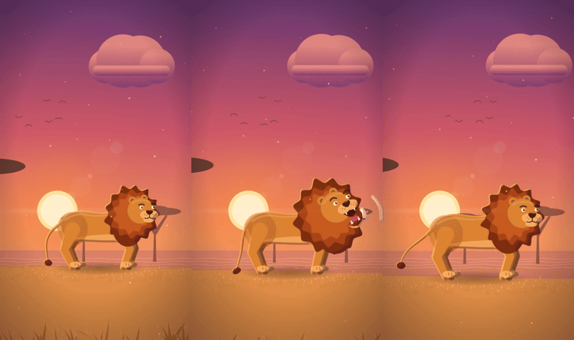
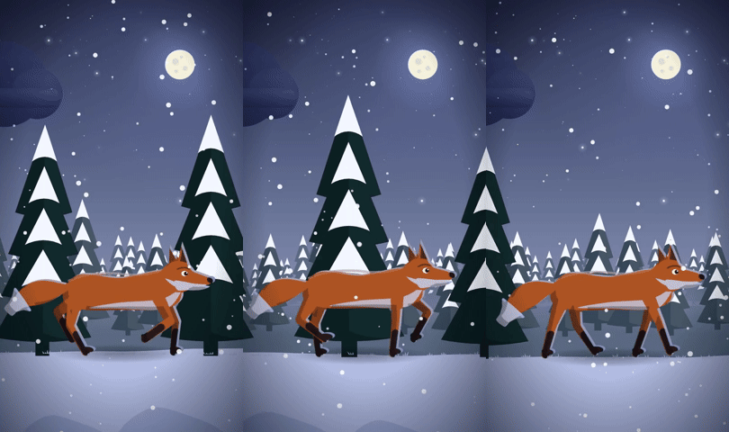
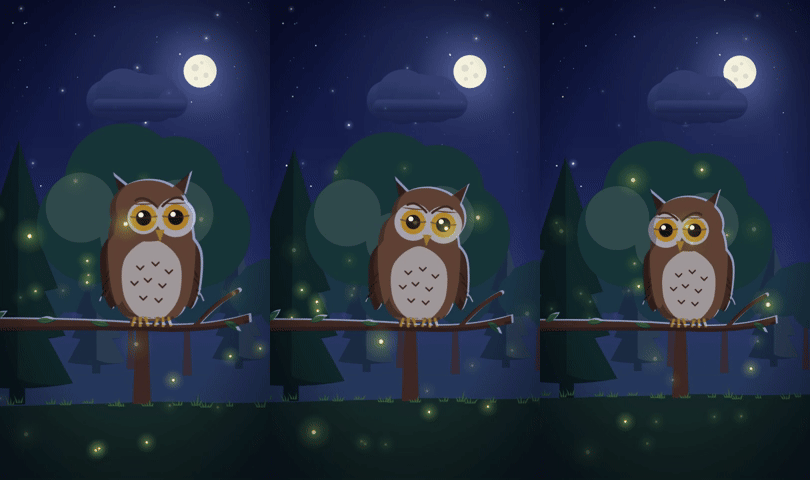
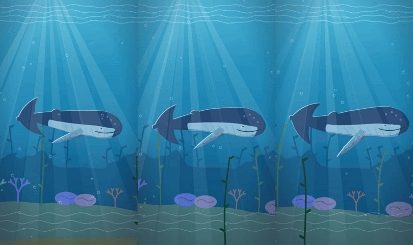
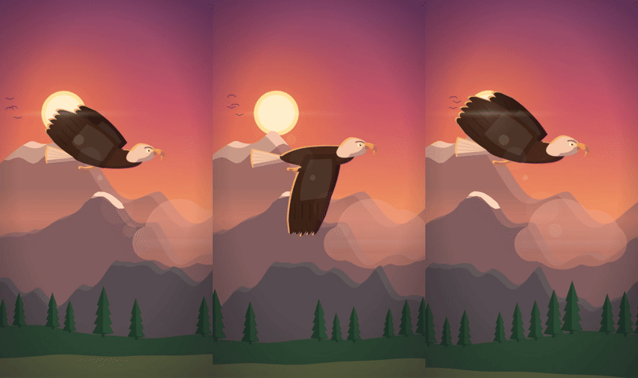
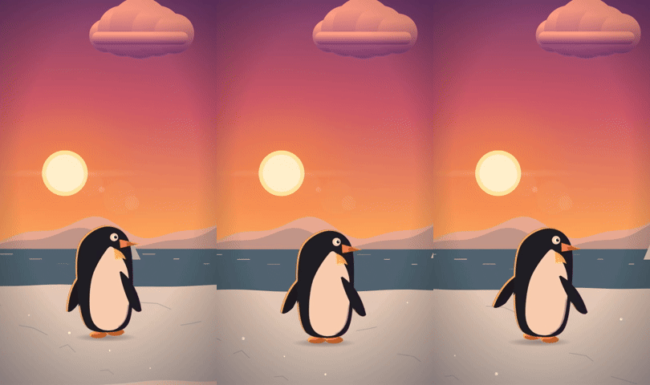
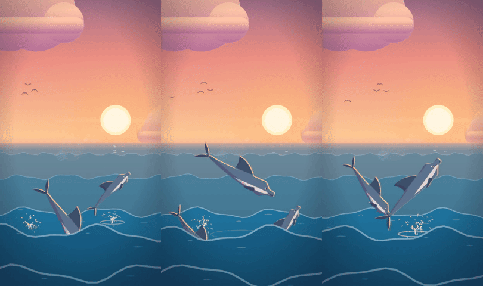

# Procedural scene engine (`scene` composition)

When no AI video provider (Kling / Veo) is available, every shot is rendered as
real 2-D animation: articulated SVG characters with idle + action motion,
parallax settings with ambient motion, particle/light effects and a moving
camera. Everything is deterministic from `(prompt, seed)` (Remotion
`random()` + an FNV hash in the parser, never `Math.random`).

```bash
npm run scene:check                              # parse ~20 sample prompts, assert the expected picks
npm run scene -- --jobs jobs.json                # render a batch (one bundle, one browser)
npm run scene -- --jobs jobs.json --concurrency 4 --crf 20
npm run studio                                   # preview the `scene` composition interactively
```

`jobs.json`:

```json
[{ "prompt": "A lion roars on the savanna at sunset", "seed": 4,
   "durationInSeconds": 5, "width": 540, "height": 960, "out": "out/lion.mp4" }]
```

`out` is resolved relative to the jobs file. One JSON line per finished job is
printed to stdout (`{"out":"/abs/lion.mp4","ok":true,"ms":9400,"frames":150}`,
or `"ok":false,"error":…`); logs go to stderr; exit code 1 if any job failed.
The CLI uses `build/bundle` when it exists **and** contains `scene`, otherwise a
content-hashed bundle in `node_modules/.cache/clipforge-scene-bundle/<hash>`
(re-bundled only when `src/` changes). `--bundle <dir>` / `REMOTION_BUNDLE`
override it. `REMOTION_BROWSER_EXECUTABLE`, `REMOTION_GL`,
`REMOTION_CONCURRENCY` and `RENDER_CRF` are honoured like the worker. Output is
h264, yuv420p, no audio track.

Composition props (zod-validated, `src/scenes/schema.ts`):
`{ prompt: string; seed: number; durationInSeconds: number; width: number; height: number }`,
30 fps; `calculateMetadata` sets duration and (even-rounded) size from the props.

## Pipeline

```
prompt ──parse.ts──▶ SceneSpec {character, role, gender, count, setting, time, weather, action, effects[], camera, color}
                          │
Scene.tsx: palette (time × weather × setting) → camera (move + impact shakes)
           setting.Back (sky → far → mid → near parallax layers)
           back effects (rain/snow/fireflies/speed lines)
           characters (placed per registry, rim-light filter, contact shadow, aura)
           setting.Front (foreground grass / waves / kelp / generator)
           front effects (rain, snow, dust, bubbles, god rays, lens flare) → vignette + lightning flash
```

The virtual canvas is always 1600 units tall; width follows the aspect ratio, so
the same scene works for 9:16, 1:1 and 16:9 (wider frames simply show more
scenery). Moving subjects stay in frame while the world scrolls past them at the
matching speed (legs use 2-bone IK with planted feet, so they don't skate); in
fixed rooms (hospital, lab, power station) the subject walks across instead.

## Prompt keywords

Matching is case-insensitive on word boundaries with synonyms. The **earliest**
subject word wins; specific verbs outrank generic movement words. Anything not
pinned down falls back to per-character defaults, then to the seed.

| Kind | Id | Words (not exhaustive) |
| --- | --- | --- |
| character | `hero` | superhero, hero, caped, cape, vigilante, champion |
| | `heroine` | heroine, superheroine, supergirl, super woman — or `hero` + she/her/woman |
| | `person` | nurse · doctor/physician/surgeon · scientist/researcher/engineer · kid/child/boy/girl · worker/technician/electrician · person/man/woman/teacher/… (role picks the outfit) |
| | animals | lion/lioness · fox · owl · eagle/hawk/falcon/bird/crow · wolf/wolves/husky · cat/kitten · dog/puppy · rabbit/bunny/hare · bear/grizzly · elephant · whale/humpback/orca · fish/school of/shoal · dolphin · penguin · butterfly/moth · deer/stag/fawn/elk/gazelle |
| setting | `city` | city, street, downtown, skyline, town, buildings, traffic |
| | `rooftops` | roof, rooftop(s) (wins over `city`) |
| | `forest` | forest, woods, trees, jungle, branch, pines |
| | `savanna` | savanna(h), grassland, plains, prairie, africa, desert, safari |
| | `meadow` | meadow, field, park, garden, hills, flowers, farm |
| | `mountains` | mountain, peak, cliff, alps, summit, valley |
| | `ice` | ice, icy, arctic, antarctic, glacier, tundra, polar |
| | `ocean` | ocean, sea, waves, beach, surf, coast, water |
| | `underwater` | underwater, under the sea, reef, coral, deep sea, deep blue, seabed |
| | `sky` | sky, clouds, air |
| | `space` | space, galaxy, nebula, planet, orbit, cosmos, asteroid |
| | `hospital` | hospital, ward, clinic, emergency room, ICU, patients |
| | `lab` | lab, laboratory, experiment, research |
| | `power` | generator, power station/plant/grid, substation, turbine, reactor, factory |
| time | `sunrise` / `sunset` / `night` / `day` | dawn, morning · dusk, evening, twilight, golden hour · night, moon, dark, stars · day, noon, sunny |
| weather | `storm` / `snow` / `rain` / `fog` | thunderstorm, lightning, thunder · snow(y), blizzard, winter · rain, downpour · fog, mist, haze |
| action | `fly` `hover` `land` `zap` `walk` `run` `jump` `swim` `roar` `howl` `graze` `gesture` `flap` `spout` `idle` | flies/soars/glides · hovers/floats · lands/descends · sparks/electric/presses/touches · walks/waddles/strolls · runs/trots/gallops · jumps/leaps/hops/breaches · swims/dives · roars/growls · howls · grazes/eats · waves/explains/talks · flaps · spouts/surfaces · sits/perches/blinks/watches |
| count | 1–3 | two/pair · three/several/herd/pack/flock/pod · plural subject ("dolphins") → 3 (capped at 2 for heroes, people, elephants, whales, bears) |
| colour | hint | red, orange, gold, green, blue, purple, white, black, gray, brown, arctic/snowy (suit or fur colour where it makes sense) |

Consistency rules: aquatic animals always get water (whale/fish default to
underwater unless "surface/spout/waves"; dolphins that jump get the ocean
surface), land animals are never put underwater, storms default to night,
underwater / indoor / space scenes ignore weather. With no recognised subject
the seed picks a curated combo (or a character that fits the named setting), so
"Why sleep matters for your brain" still yields a proper animated scene.

## Characters

Every character breathes/blinks (or has an equivalent idle) and gets a rim-light
+ core-shadow filter tuned to the scene light. Colours vary with the seed (and
colour words).

| Character | Motion |
| --- | --- |
| hero / heroine (original design: shield + star emblem, optional domino mask) | **hover** (bob, slow ascent, flowing cape, glowing fists), **fly** (profile, fist forward, travelling-wave cape, kicking legs, speed lines, scrolling world), **land** (descends, knee-bend impact with camera shake, recovers), **zap** (arms rise, arcs between/under the hands, spark showers); 7 suit palettes × 6 skin tones × 6 hair colours |
| person (nurse / doctor / scientist / kid / worker / civilian, gender from pronouns) | **walk** (IK gait, arm swing), **gesture** (talking hand, nodding, mouth), **zap** (arms pressed forward, arcs crawl from hands up to the shoulders, hair stands on end, body shake), idle |
| lion | mane lobes ripple; **roar** (anticipation dip, head up, jaw open with fangs, mane flare, sound rings, camera shake), walk, tail with tuft |
| fox | **trot** (diagonal gait, bushy tail with white tip, dark socks), walk, idle |
| wolf | **howl** (body tilts, head to the sky, sound rings), trot, idle |
| dog | **run** (trot, floppy ears, tongue out, wagging tail, collar), idle wag |
| cat | idle (tail swish, slit-pupil blink, ear twitch, head tilt), walk; tabby stripes |
| owl | perched on a branch: slow blink with eyelids, **head turns** left/right, ear tufts, periodic **wing flap** bursts |
| eagle | flapping bursts blended into swept-back glides, bob, head look |
| penguin | **waddle** (side-to-side rock, stepping feet, flippers), hop, idle |
| rabbit | **hop** cycle (crouch → stretch → land), ear swing, nose twitch |
| bear | slow heavy **walk**, optional roar |
| elephant | ear flap, trunk sway, tail, slow **walk** |
| deer (stag or spotted fawn) | **graze** (neck down, chewing, looks up), **leap** (airborne arcs with extended legs), walk, ear/tail flicks |
| whale (humpback, orca variant) | **swim** (body wave, fluke beat, pectoral fins), **spout** at the surface |
| fish | a school of 26 fish at several depths, wagging tails |
| dolphin | **jump** arcs out of the waves with exit/entry splashes, or swim underwater |
| butterfly | wing flutter, wandering path (monarch / morpho / swallowtail / pink palettes) |

## Settings (parallax layers + ambient motion)

| Setting | Layers & ambient motion |
| --- | --- |
| city | gradient sky, stars/moon or sun, far skyline, mid + near buildings with twinkling windows and blinking antenna lights, street with lamps, cycling traffic lights, passing cars with headlights |
| rooftops | city behind + foreground roofs with water towers, spinning AC fans, blinking antennas |
| forest | hills, three depths of swaying pines / leafy trees, grass, foreground bushes; snow caps in snow; fireflies at night |
| savanna | mesas, acacias, heat shimmer lines, swaying golden grass, distant bird flock |
| meadow | rolling hills, trees, grass with swaying flowers |
| mountains | four snow-capped ranges with shaded faces, drifting mist, pine ridge |
| ice | ice cliffs, dark sea with bobbing icebergs and glints, cracked ice floor with sparkles, snow drifts |
| ocean | horizon haze, sun glitter path, five wave bands with foam at different depths/speeds |
| underwater | surface ripples, god rays, far rock + kelp silhouettes, coral, anemones, swaying kelp, caustics, bubbles |
| sky | cloud layers at several depths, flock of birds |
| space | nebulae, twinkling stars, ringed planet with drifting bands, moon, tumbling asteroids, shooting stars, lunar ground |
| hospital | one-point-perspective corridor, flickering ceiling panel, doors, exit sign, ECG monitor, swaying IV bag with drips |
| lab | monitors (ECG / bars / rotating DNA), shelves, bubbling glowing flasks, hanging lamps |
| power | pipes, jittering gauges, rotating amber beacons, hazard stripes, big generator with glowing coil, blinking panel, arcing terminals + sparks |

## Effects

`effects/atmos.tsx`: rain (two depths + splashes), snow (two depths), fireflies,
dust motes, god rays, bubbles, lens flare, lightning (branching bolts + scene
flash that also brightens sky, clouds and characters' rim light), speed lines,
energy aura. `effects/energy.tsx`: crackling arcs (re-rolled every 2 frames,
with branches), spark showers with gravity, pulsing energy balls.

Camera (`camera.ts`): `push`, `pull`, `pan` or `drift` chosen per scene from the
seed (movement actions prefer drift/pan), plus a handheld float and decaying
shakes on lightning strikes, landings and roars.

## Contact sheets

Rendered at 540×960, frames at 12 % / 50 % / 88 % of each 5 s clip.

| Prompt | Sheet |
| --- | --- |
| A caped superhero flies over a city at night during a thunderstorm, lightning flashing |  |
| A nurse presses her hands on a generator and electric sparks crawl up her arms |  |
| A glowing hero hovers above rooftops at sunrise |  |
| A lion roars on the savanna at sunset |  |
| A red fox trots through a snowy forest |  |
| An owl blinks on a branch under the moon with fireflies |  |
| A whale swims through deep blue ocean with light rays |  |
| An eagle soars over mountains |  |
| A penguin waddles on the ice |  |
| Three dolphins jump out of the waves |  |

## Performance

In the 4-core sandbox (headless shell, software GL) a 5 s 540×960 clip renders
in ~9–15 s (storm/rooftop/underwater scenes are the heaviest), a 5 s
1080×1920 clip in ~30 s. Bundling adds ~7 s once per source change.

## Known limitations

- Characters are drawn from one side (profile, or front for hover/land/zap and
  the owl); there is no turning around, and all walkers face right.
- One subject species per shot (plus copies); there are no interactions between
  different characters, and no props beyond the generator and the owl's branch.
- Proportions are stylised; the whale and dolphin bodies are fairly simple, and
  the flying hero's face is small at 540 px wide.
- Re-rendering the same job gives visually identical frames (PSNR ≈ 66 dB);
  JPEG/x264 threading makes the bytes differ slightly.

## Files

| Path | What |
| --- | --- |
| `index.tsx` | Registers the `scene` composition (`calculateMetadata`) |
| `schema.ts` | zod props schema, fps |
| `parse.ts`, `check.ts` | prompt → `SceneSpec`; `npm run scene:check` |
| `Scene.tsx` | composition: context, placement, layer order, grade |
| `palette.ts`, `camera.ts`, `ctx.ts` | lighting palettes, camera + timed events, per-frame context |
| `lib/` | seeded maths/noise/easing, colour maths, SVG helpers (parallax `Layer`, `tiles`, rim-light filter, glows), IK/gait rig |
| `settings/` | `city.tsx`, `nature.tsx` (forest, savanna, meadow, mountains, ice, sky), `water.tsx` (ocean, underwater, space), `interior.tsx` (hospital, lab, power) |
| `characters/` | `hero.tsx`, `person.tsx`, `felines.tsx`, `canines.tsx`, `big.tsx`, `birds.tsx`, `small.tsx`, `aquatic.tsx`, shared `quad.tsx`, registry `index.tsx` |
| `effects/` | `atmos.tsx`, `energy.tsx` |
