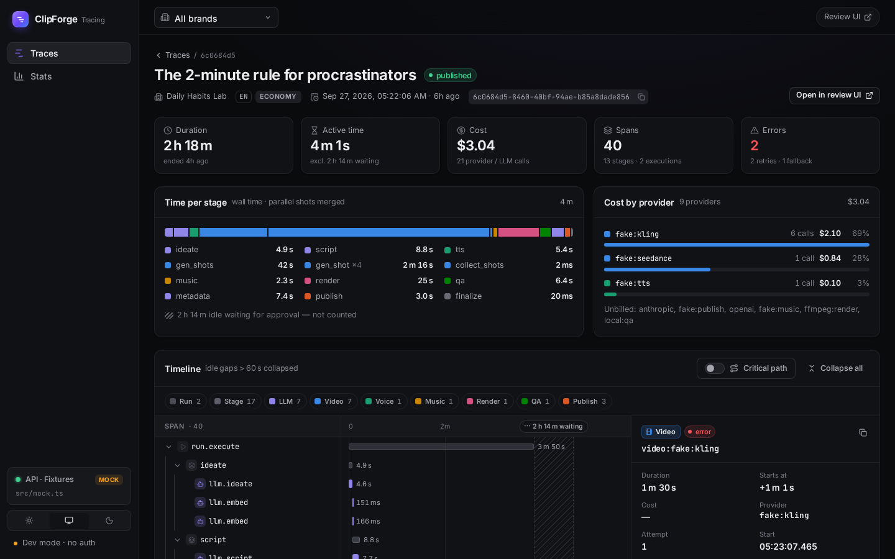
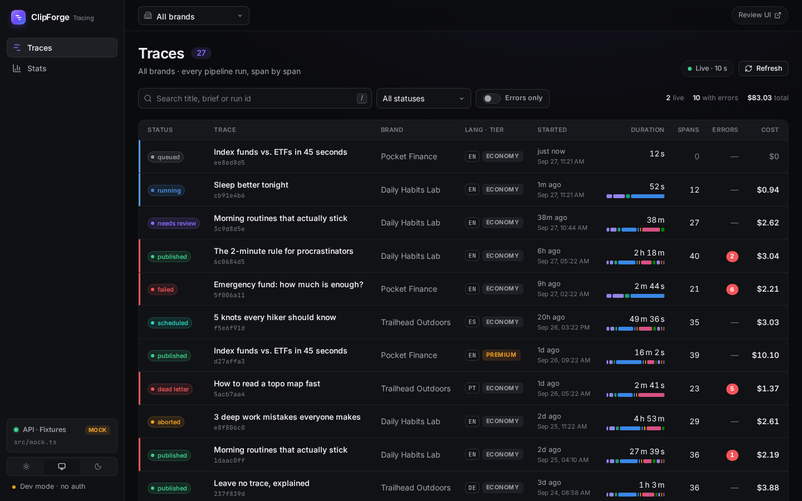
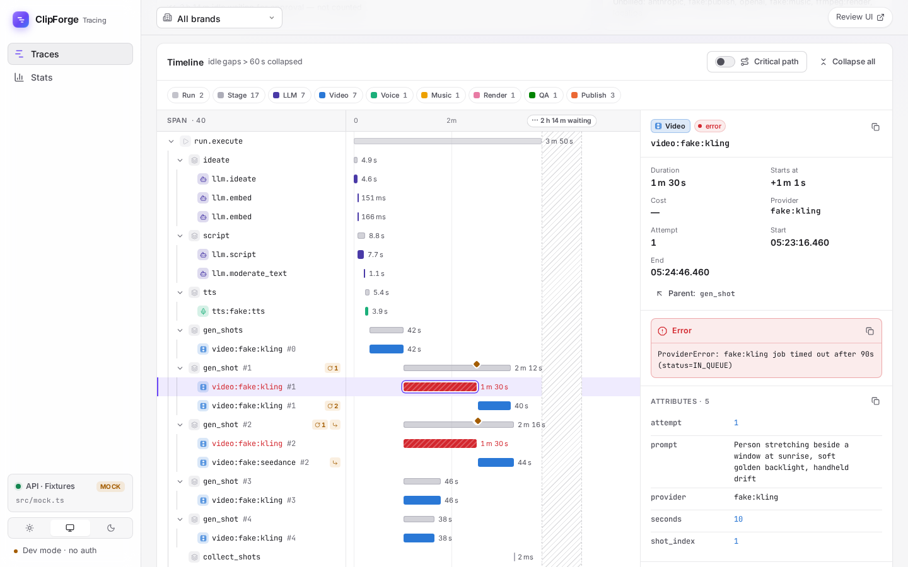
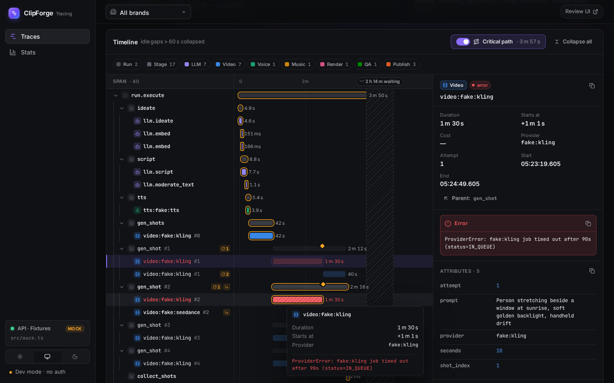
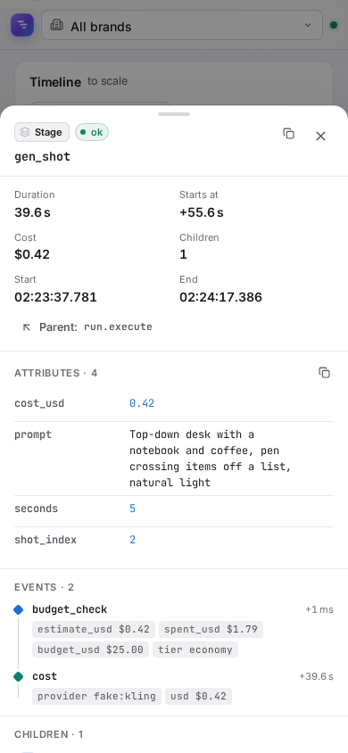
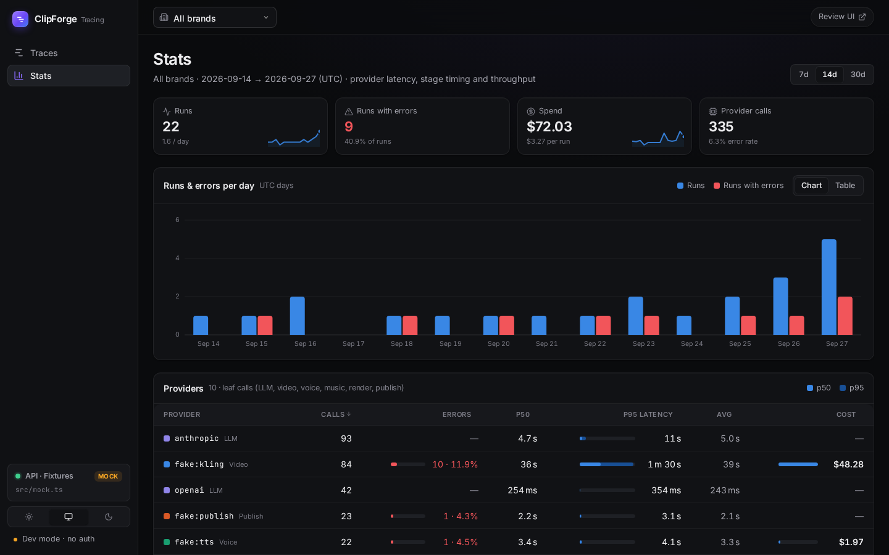

# ClipForge Tracing

An observability console for the ClipForge AI video pipeline: every run is a
**trace**, every worker execution, pipeline stage and provider / LLM call is a
**span**. Think Langfuse / Jaeger / Honeycomb trace views, tuned for this
pipeline: approval waits that last hours, parallel shot generation, retries,
provider fallbacks and per-call cost.

It is a separate app from the review console in [`../ui`](../ui) (same brand,
same design tokens) and talks to the same FastAPI backend.



## Screens

| | |
|---|---|
| **Traces** — filterable, searchable list; status, brand, language/tier, start, duration, span count, error badge, cost. Auto-refreshes every 10 s (pausable), `/` focuses search, filters live in the URL. |  |
| **Trace detail** — header KPIs, time per stage (stacked bar, parallel shots merged), cost by provider, and the **waterfall**: collapsible span tree, bars coloured by kind, error spans hatched red, retry / fallback / cache-hit / paused event markers, hover tooltip, idle gaps > 60 s collapsed into a `⋯ 2 h 14 m waiting` break. |  |
| **Critical path** — highlights the chain of spans that determined when the trace ended (walks back from the latest finisher; parallel siblings are off-path). |  |
| **Span panel** — kind, status, duration, offset from trace start, cost, provider/model, the error message / stack, every attribute (copy per row or as JSON), the events timeline, children and parent links. A side panel on wide screens, a drawer below 1280 px, a bottom sheet on phones. |  |
| **Stats** — 7 / 14 / 30-day window: runs, runs with errors, spend (with sparklines), provider calls; runs & errors per day (chart ⇄ table); provider table (calls, error rate, p50 / p95 / avg latency, cost — sortable, inline bars); stage latency p50/p95; slowest traces. |  |

More: [light theme](docs/screenshots/traces-light.png) ·
[stats light](docs/screenshots/stats-light.png) ·
[phone: traces](docs/screenshots/traces-mobile-dark.png) ·
[phone: trace](docs/screenshots/trace-mobile-dark.png) ·
[phone: waterfall](docs/screenshots/trace-waterfall-mobile-dark.png) ·
[phone: stats](docs/screenshots/stats-mobile-light.png) ·
against the live dev backend: [traces](docs/screenshots/live-traces-dark.png),
[resumed trace with a 16 min approval gap](docs/screenshots/live-trace-dark.png),
[stats](docs/screenshots/live-stats-dark.png).

## Run it

```bash
cd tracing
npm install

# against a local backend (http://localhost:8000; /api is proxied, prefix stripped)
clipforge dev --port 8000 --runs 3 &     # fake providers + demo runs
npm run dev                              # http://localhost:5174

# no backend: built-in fixtures (src/mock.ts) with errors, retries, fallbacks,
# approval gaps, a live-running trace and 30 days of history
npm run dev:mock                         # same as VITE_MOCK=1 npm run dev

npm run typecheck
npm run build && npm run preview         # http://localhost:4174
```

### Configuration

| Variable | Default | |
|---|---|---|
| `VITE_API_URL` | `/api` | API base the browser calls (build-time). |
| `API_PROXY_TARGET` | `http://localhost:8000` | Dev-server target for `/api` (prefix stripped). |
| `VITE_REVIEW_UI_URL` | `http://localhost:5173` | "Open in review UI" links: a base URL (`/runs/<id>` is appended) or a template containing `:id`. |
| `VITE_SUPABASE_URL`, `VITE_SUPABASE_ANON_KEY` | — | Optional Supabase auth (same project as the review UI). When set, the app requires sign-in and sends `Authorization: Bearer <jwt>`; when unset it runs in dev mode with no auth. |
| `VITE_MOCK` | — | `1` serves fixtures instead of calling the API (tree-shaken out of normal builds). |

Copy [`.env.example`](.env.example) to `.env.local` to override.

### Docker

```bash
docker build -t clipforge-tracing \
  --build-arg VITE_REVIEW_UI_URL=https://review.example.com \
  --build-arg VITE_SUPABASE_URL=... --build-arg VITE_SUPABASE_ANON_KEY=... \
  tracing
docker run -p 8081:80 -e API_UPSTREAM=http://api:8000 clipforge-tracing
```

nginx serves the SPA (history fallback to `index.html`, immutable hashed
assets) and proxies `/api/*` to `API_UPSTREAM` with the prefix stripped
(unbuffered, so SSE works too). `API_UPSTREAM` is substituted at container
start, so one image works in every environment.

## API contract

| Endpoint | Used by |
|---|---|
| `GET /traces?brand_id=&status=&q=&limit=50` → `{items: TraceSummary[]}` | Traces list. `status=error` = traces with `error_count > 0`; combined with a run-status filter, the run status is applied client-side. |
| `GET /traces/{trace_id}` → `{trace, spans}` | Trace detail. Polled every 3 s while the run is `queued` / `running` / `resume_requested` (15 s while awaiting approval). |
| `GET /traces/stats?from=&to=&brand_id=` → `{providers, stages, throughput, slowest}` | Stats. Missing days in `throughput` are filled with zeros. |
| `GET /brands` → `{items}` | Brand filter (top bar, remembered in `localStorage`). |

Types live in [`src/types.ts`](src/types.ts). The UI is tolerant of what real
traces look like:

- **Orphans** — a span whose `parent_id` is not in the trace is rendered as a root (marked *orphan*).
- **Open spans** (`end_at: null`) extend to *now* while the run is live, else to the last known instant; they get a pulsing edge.
- **Cost** — per-provider cost comes from `cost` events (`{provider, usd}`), which the backend attaches to stage spans; `cost_usd` on a span is used when there are no cost events. The span panel shows a span's own `cost_usd` (or the sum of its cost events), and "Cost (children)" for containers.
- **Provider** of a leaf span = `attributes.provider`, else `renderer`, else (LLM spans) `model`.
- **Optional `TraceSummary.stages`** (`{name, duration_ms, status?}[]`) — if the list endpoint includes it, each row gets a mini stacked stage bar next to its duration.

## How the waterfall works

All logic is in [`src/lib/timeline.ts`](src/lib/timeline.ts) (pure functions).

1. **Tree** — spans are linked by `parent_id`, children sorted by start; each span knows its depth and how many errors sit below it (shown on collapsed rows).
2. **Gap compression** — boundaries are every span start/end and event time. A stretch longer than **60 s** in which no *working* span is open (a leaf that is not a wait span such as `approve` or one with a `paused` event) becomes a gap. Containers (`run.execute`, stages) and wait spans may cross a gap; their bars show the break.
3. **Projection** — gaps become fixed-width hatched breaks labelled `⋯ 16 m 29 s waiting`. Active segments share the rest of the width in proportion to their duration, but each gets at least a minimum share, so the few seconds of `metadata` / `publish` after a two-hour approval wait stay readable. Ticks are computed per segment; the first counts from trace start, later ones from the break (`+10s`).
4. **Critical path** — starting from the end of the trace (all roots behave as children of a virtual root), take the child that finished last, recurse into it, then continue with siblings that finished before it started. Overlapping siblings (parallel shots) are off the path.
5. **Stage time** — wall time per stage name with parallel spans merged (interval union); approval waiting is reported separately rather than dwarfing the bar.

### Keyboard

| Key | |
|---|---|
| `↑` `↓` (or `k` `j`) | Previous / next span (selection follows; on narrow screens press `Enter` to open the panel) |
| `←` / `→` | Collapse / expand, or jump to parent / first child |
| `Home` / `End` | First / last span |
| `Enter` / `Space` | Open the span panel |
| `Esc` | Close the drawer / sheet |
| `/` | Focus search (Traces) |

## Design notes

- Tokens, typography (Inter + JetBrains Mono), pills, cards, the sidebar and
  top bar mirror `ui/src/styles.css`, so the two apps feel like one product.
  Dark first; light via `prefers-color-scheme` or the theme switch
  (`localStorage` key `cft.theme`, applied before first paint).
- Span-kind colours (LLM violet, voice aqua, video blue, music yellow, render
  magenta, QA green, publish orange; run/stage/internal neutral) were chosen so
  every pair that sits side by side in the stage bar passes the colour-vision
  and contrast checks in both themes; red is reserved for errors, which are
  also hatched and carry an icon, so status never relies on colour alone.
- Responsive down to 390 px: the sidebar becomes a bottom nav, the traces
  table becomes cards, the waterfall scrolls horizontally with a sticky name
  column, the span panel becomes a bottom sheet.

## Layout

```
tracing/
├── src/
│   ├── api.ts              fetch wrapper (Bearer JWT, health), mock switch, review-UI links
│   ├── supabase.ts         optional auth client
│   ├── types.ts            API contract
│   ├── mock.ts             VITE_MOCK fixtures (lazy-loaded)
│   ├── lib/timeline.ts     tree, gap compression, projection, ticks, critical path, summaries
│   ├── lib/kinds.ts        span-kind labels, icons, colours, stage order
│   ├── components/         Shell, Waterfall, SpanPanel, charts, ui primitives
│   ├── pages/              TracesPage, TraceDetailPage, StatsPage
│   └── styles.css          design tokens + components
├── Dockerfile, nginx.conf  static build → nginx, runtime API_UPSTREAM
└── docs/screenshots/
```
